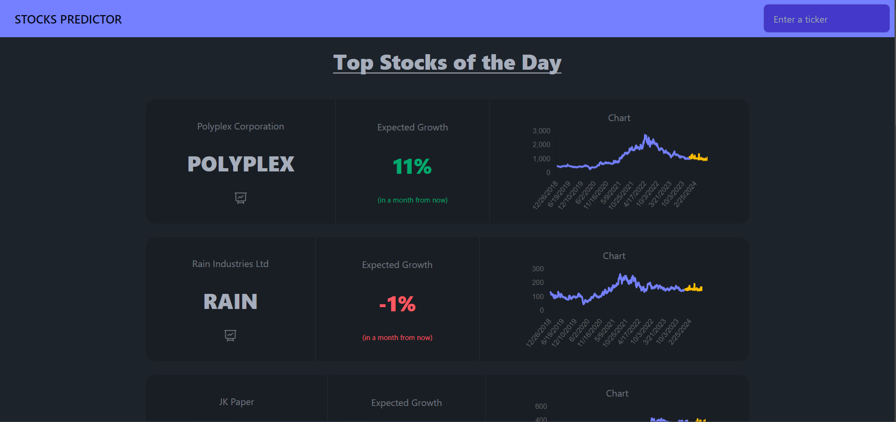
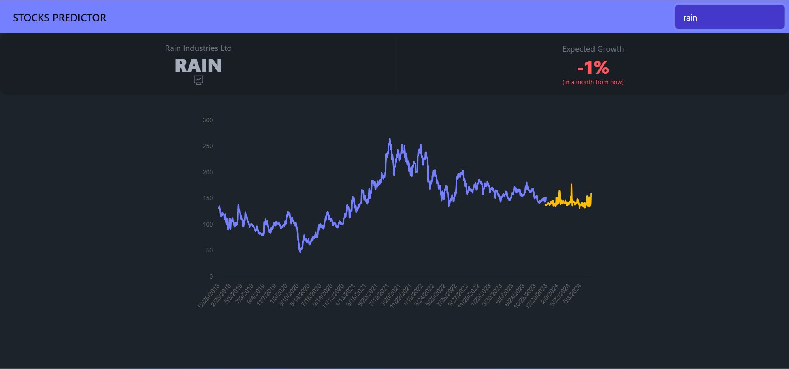

# Stock Predictor

A simple application which uses some top stocks and fetches historical data of them and predicts a price for the future.

# Running the program

- Change into the backend directory using `cd stock_predictor`
- Install the required dependencies for backend using `poetry install`.
- Move back into the base directory using `cd ..`.
- Change into the web app directory using `cd stock_predictor_web`
- Install the required dependencies for web app using `pnpm install`.
- Build the web app using `pnpm build`.
- Run the web app using `pnpm preview`.
- Move back into the base directory using `cd ..`.
- Run the program using `poetry run python main.py` and head to `http://localhost:5173`

:warning: **NOTE**: This project uses the latest version of `poetry` and there are some breaking changes in how poetry stores its config files so older versions might not work. So, please use the latest version.
